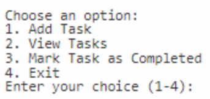
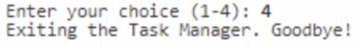
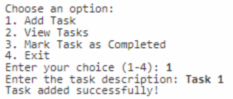
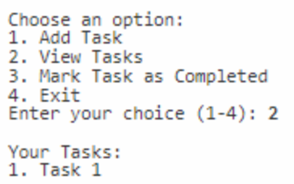
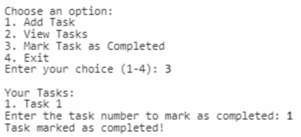
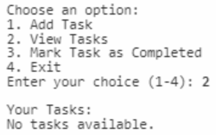

# Class 2 Homework

Create a task manager basic console application.
This will allow users to add tasks, mark tasks as completed, and view their tasks.The application should run in a loop only exiting when the user selects a specific option.
Next, you can see the workflow:

