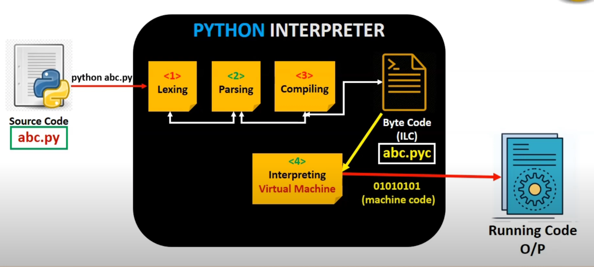
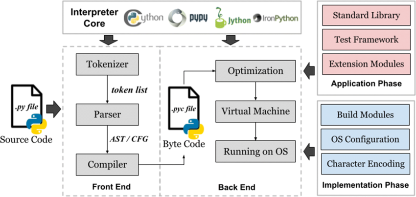

# Class 1 Homework

Using the C# Common Language Infraestructure shown (Compiler, CLR, JIT, etc) compare with other Language Infraestructyure, you can pick any othe language you than F# or Visual Basic.
Use images, pictures, diagrams if it helps you to explain the concepts.

En el caso de Python, al ejecutar el codigo fuente, archivo con extension .py, un componente del interprete de python llamado lexer divide el codigo en tokens (un proceso que se llama lexing).

Luego, otro componente del interprete de python llamado parser, utiliza estos tokens para construir una estructura llamada arbol de sintaxis abstracta "Abstract Syntax Tree", es decir esta estructura representa la relacion entre esos tokens.

En el siguiente paso, el compilador (otro componente del interprete de python) convierte esta estructura en un lenguaje de codigo intermedio (ILC), llamado bytecode.

Este codigo, Bytecode, es almacenado en un archivo con extencion .pyc que tiene el mismo nombre que el archivo con extension .py, pero con la diferencia que el archivo con extension .pyc se encuentra en un directorio llamado __pycache__.

El Bytecode es una representación del codigo fuente de bajo nivel independiente de la plataforma.

La maquina virtual de python (Python Virtual Machine - PVM), que es otro componente del interprete de python, carga el bytecode (junto con todas las dependencias y librerias) en el tiempo de ejecucion y lo convierte a codigo ejecutable de maquina (0 y 1 en binario).

Si no ocurre ningun error en todo el proceso, genera el resultado de la ejecucion del codigo fuente.

## Si bien la mayor diferencias entre python y C# es que python es un lenguaje interpretado y C# es un lenguaje compilado, ambos lenguajes tienen un interprete y un compilador. Ambos transformaran el codigo fuente en un lenguaje intermedio, que luego sera convertido a codigo ejecutable de maquina.