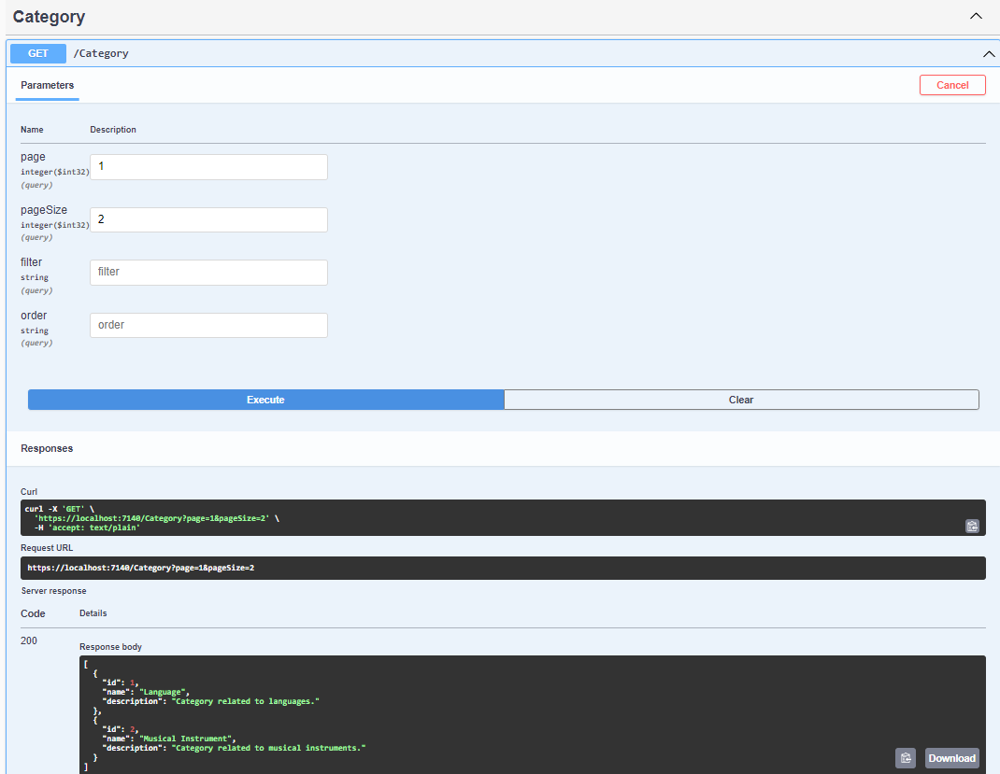

# Class 12 Homework

## This is a continuation of the preovious exercise.

Implement the API for a specific Domain model. You can implement for more than one but at least the implementation for one is required

- Implement DELETE and PUT endpoints
- Implement/update a GET request endpoint that supports paging, if it also supports filtering then is a plus
- In case you are using a database ensure that ConnectionString is and appsetting, and the value is not in your remote repository but under a secret. In case you are using a in memory collection as database, add to the constructor a required parameter that will be called ConnectionString, and ensure that if the ConnectionString value is not valid then and exception is thrown; handle this ConnectionString as defined before for the database case.

NOTE: You can use othe ideas generated from the design process from the previous workfow if it helps

The focus of this excercise is on the implementation of the API, so it is not necessary to use a database, since we will be covering that topic later. But as mentioned it is allowed

# Implementation / Evidence:

## With page size

## With filter

## With no ConnectionString value

