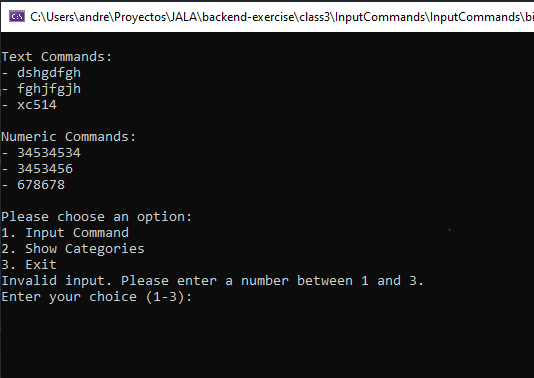

# Class 2 Homework

Create a console application that gives the user 3 options:
1. input commands
2. show categories
3. exit

When selecting 1 the user can input anything, this information shoud be categorized between text and numbers, and separated in different collections.
Whent selecting 2 the user should see a List of Text commands and a List of numeric commands

### Result

